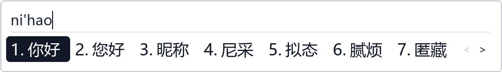
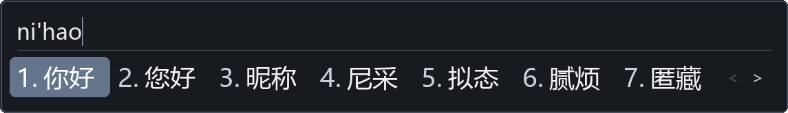
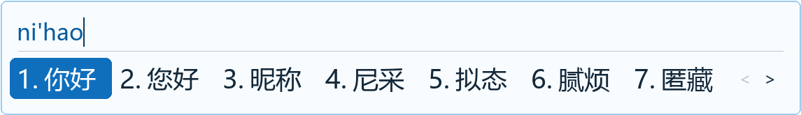
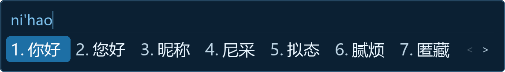
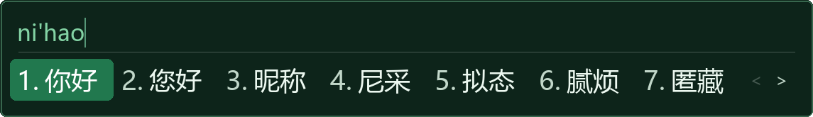
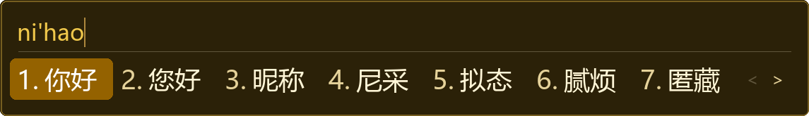
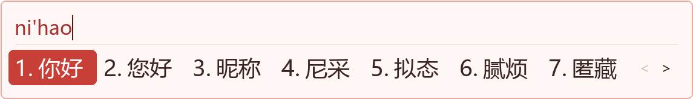
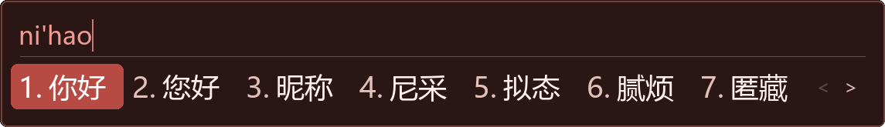
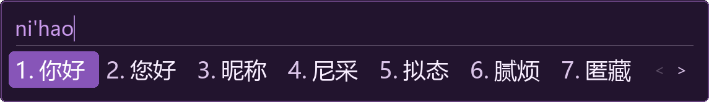

# CxxIME

**English** | [中文](README.md)


> A lightweight Windows TSF (Text Services Framework) input method (Pinyin + Wubi + Mixed).

CxxIME is a lightweight Windows TSF-based input method with three modes: Pinyin, Wubi 86, and mixed Pinyin + Wubi. It uses a client/server architecture: the TSF DLL captures keystrokes and talks to a background server over IPC, and the server handles Pinyin parsing, dictionary lookup, and candidate generation.

## Features

- Pinyin, Wubi 86, and mixed input modes, with shorthand Pinyin, fuzzy matching, and Wubi shortcut codes
- Top-N candidates ranked in tiers by match quality, so frequent long words do not overshadow exact syllable matches
- A unique four-code Wubi candidate is committed automatically (configurable)
- App hosts can take over inline preedit and candidate-window rendering via TSF UIElement (verified in DOTA2)
- 12 built-in color themes (6 palettes × light/dark), with horizontal and vertical layouts
- Candidate learning is off by default; preferences persist independently and can be cleared in Settings

## Screenshots

Candidate window theme previews (6 palettes × light/dark):

| Palette | Light | Dark |
|---------|-------|------|
| Moon |  |  |
| Sky |  |  |
| Jade |  |  |
| Amber |  |  |
| Coral |  |  |
| Iris |  |  |

## Installation

1. Run `cxxime-v<version>-setup.exe` and follow the wizard
2. **Log off and log back on** after installation
3. Switch to CxxIME with `Ctrl+Space` or `Win+Space`

See [docs/installation.md](docs/installation.md) for detailed installation, uninstall, and upgrade instructions.

## Configuration

- Use **CxxIME Settings** from the Start Menu
- Or edit the user configuration file `%USERPROFILE%\cxxime\default.json` directly

All options (input modes, candidate window, themes, dictionary management, shortcuts, etc.) are documented in [docs/settings-guide.md](docs/settings-guide.md).

## Dictionaries

CxxIME ships with Pinyin and Wubi 86 dictionaries. The Pinyin data comes from [rime-ice](https://github.com/iDvel/rime-ice) (~1.9M entries, GPL-3.0-only), and the Wubi data from [KyleBing/rime-wubi86-jidian](https://github.com/KyleBing/rime-wubi86-jidian) (Apache-2.0). Dictionary sources and licenses are documented in [data/README.md](data/README.md), and the data formats and build/maintenance pipeline in [docs/dictionary.md](docs/dictionary.md).

## Building from Source (Developers)

```cmd
build.bat              # Release build
build.bat debug        # Debug build (tests and tools enabled)
```

Requirements: Windows 10/11, Visual Studio 2022 (C++ workload), CMake 3.15+, Python 3.10+ (needed for dictionary generation and packaging). See [docs/installation.md](docs/installation.md) for full build and packaging instructions, [docs/architecture.md](docs/architecture.md) for the architecture overview, and [tools/README.md](tools/README.md) for the development tools.

## License

The project code is released under the Apache License 2.0. Third-party components and dictionary data retain their respective licenses; see [THIRD_PARTY_NOTICES.txt](THIRD_PARTY_NOTICES.txt).
